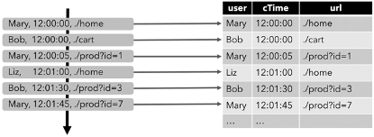

**前言**

 &emsp;  &emsp; 如果用户需要同时流计算、批处理的场景下，用户需要维护两套业务代码，开发人员也要维护两套技术栈，非常不方便。

 &emsp;  &emsp; Flink 社区很早就设想过将批数据看作一个有界流数据，将批处理看作流计算的一个特例，从而实现流批统一，Flink 社区的开发人员在多轮讨论后，基本敲定了Flink 未来的技术架构：


**Apache Flink 有两种关系型 API 来做流批统一处理：Table API 和 SQL**。

Table API 是用于 Scala 和 Java 语言的查询API，它可以用一种非常直观的方式来组合使用选取、过滤、join 等关系型算子。

Flink SQL 是基于 [Apache Calcite](https://calcite.apache.org/) 来实现的标准 SQL。这两种 API 中的查询对于批（DataSet）和流（DataStream）的输入有相同的语义，也会产生同样的计算结果。


## 一、核心概念
Flink 的[Table API](https://ci.apache.org/projects/flink/flink-docs-release-1.12/zh/dev/table/tableApi.html)和[SQL](https://ci.apache.org/projects/flink/flink-docs-release-1.12/zh/dev/table/sql/)是流批统一的 API。这意味着TableAPI & SQL在无论有限的批式输入还是无限的流式输入下，都具有相同的语义。因为传统的关系代数以及SQL 最开始都是为了批式处理而设计的，关系型查询在流式场景下不如在批式场景下容易理解。

### 1.1 动态表和连续查询

***动态表(Dynamic Tables)***是Flink的支持流数据的Table API和SQL的核心概念。与表示批处理数据的静态表不同，动态表是**随时间变化**的。可以像查询静态批处理表一样查询它们。查询动态表将生成一个**连续查询**(Continuous Query)。一个连续查询永远不会终止，结果会生成一个动态表。查询不断更新其(动态)结果表，以反映其(动态)输入表上的更改。

需要注意的是，连续查询的结果在语义上总是等价于以批处理模式在输入表快照上执行的相同查询的结果。


1. 将流转换为动态表。
2. 在动态表上计算一个连续查询，生成一个新的动态表。
3. 生成的动态表被转换回流。

#### 在流上定义表(动态表)
为了使用关系查询处理流，必须将其转换成Table。从概念上讲，流的每条记录都被解释为对结果表的 INSERT操作。
假设有如下格式的数据:
```yaml
[
  user:  VARCHAR,   // 用户名
  cTime: TIMESTAMP, // 访问 URL 的时间
  url:   VARCHAR    // 用户访问的 URL
]

```

下图显示了单击事件流(左侧)如何转换为表(右侧)。当插入更多的单击流记录时，结果表的数据将**不断增长**。



#### 连续查询

在动态表上计算一个连续查询，并生成一个新的动态表。与批处理查询不同，连续查询从不终止，并根据**其输入表上的更新**更新其结果表。

在任何时候，连续查询的结果在语义上与以批处理模式在输入表快照上执行的相同查询的结果相同。


1. 当查询开始，clicks 表(左侧)是空的。
2. 当**第一行数据**被插入到 clicks 表时，查询开始计算结果表。第一行数据 [Mary,./home] 插入后，结果表(右侧，上部)由一行 [Mary, 1] 组成。
3. 当第二行 [Bob, ./cart] 插入到 clicks 表时，查询会更新结果表并插入了一行新数据 [Bob, 1]。
4. 第三行 [Mary, ./prod?id=1] 将产生已计算的结果行的更新，[Mary, 1] 更新成 [Mary, 2]。
5. 最后，当第四行数据加入 clicks 表时，查询将第三行 [Liz, 1] 插入到结果表中。

## 二、Flink Table API

### 2.1 maven依赖

```xml
<dependency>
    <groupId>org.apache.flink</groupId>
    <artifactId>flink-table-planner-blink_${scala.binary.version}</artifactId>
    <version>${flink.version}</version>
</dependency>
<dependency>
    <groupId>org.apache.flink</groupId>
    <artifactId>flink-streaming-scala_${scala.binary.version}</artifactId>
    <version>${flink.version}</version>
</dependency>
<dependency>
    <groupId>org.apache.flink</groupId>
    <artifactId>flink-csv</artifactId>
    <version>${flink.version}</version>
</dependency>
<dependency>
    <groupId>org.apache.flink</groupId>
    <artifactId>flink-json</artifactId>
    <version>${flink.version}</version>
</dependency>
```

### 2.2 基本使用:表与DataStream的混合使用


案例：**筛选出指定id的水位传感器**

1、引入基础依赖

```xml
<properties>
        <maven.compiler.source>8</maven.compiler.source>
        <maven.compiler.target>8</maven.compiler.target>
        <flink.version>1.12.0</flink.version>
        <java.version>1.8</java.version>
        <scala.binary.version>2.11</scala.binary.version>
        <slf4j.version>1.7.30</slf4j.version>
    </properties>

    <dependencies>
        <dependency>
            <groupId>org.apache.flink</groupId>
            <artifactId>flink-java</artifactId>
            <version>${flink.version}</version>
        </dependency>
        <dependency>
            <groupId>org.apache.flink</groupId>
            <artifactId>flink-streaming-java_${scala.binary.version}</artifactId>
            <version>${flink.version}</version>
        </dependency>
        <dependency>
            <groupId>org.apache.flink</groupId>
            <artifactId>flink-clients_${scala.binary.version}</artifactId>
            <version>${flink.version}</version>
        </dependency>

        <dependency>
            <groupId>org.apache.flink</groupId>
            <artifactId>flink-runtime-web_${scala.binary.version}</artifactId>
            <version>${flink.version}</version>
        </dependency>

        <dependency>
            <groupId>org.slf4j</groupId>
            <artifactId>slf4j-api</artifactId>
            <version>${slf4j.version}</version>
        </dependency>
        <dependency>
            <groupId>org.slf4j</groupId>
            <artifactId>slf4j-log4j12</artifactId>
            <version>${slf4j.version}</version>
        </dependency>
        <dependency>
            <groupId>org.apache.logging.log4j</groupId>
            <artifactId>log4j-to-slf4j</artifactId>
            <version>2.16.0</version>
        </dependency>
        <dependency>
            <groupId>org.projectlombok</groupId>
            <artifactId>lombok</artifactId>
            <version>RELEASE</version>
            <scope>compile</scope>
        </dependency>
    </dependencies>
```

2、log4j.properties

```properties
log4j.rootLogger=error, stdout
log4j.appender.stdout=org.apache.log4j.ConsoleAppender
log4j.appender.stdout.layout=org.apache.log4j.PatternLayout
log4j.appender.stdout.layout.ConversionPattern=%-4r [%t] %-5p %c %x - %m%n
```

3、WaterSensor实体类

```java
/**
 * 水位传感器：用于接收水位数据
 *
 * id:传感器编号
 * ts:时间戳
 * vc:水位
 */
@Data
@NoArgsConstructor
@AllArgsConstructor
public class WaterSensor {
    private String id;
    private Long ts;
    private Integer vc;
}
```

4、参考代码：

```java
import com.betop.basic.entity.WaterSensor;
import org.apache.flink.streaming.api.datastream.DataStream;
import org.apache.flink.streaming.api.datastream.DataStreamSource;
import org.apache.flink.streaming.api.environment.StreamExecutionEnvironment;
import org.apache.flink.table.api.Table;
import org.apache.flink.table.api.bridge.java.StreamTableEnvironment;
import org.apache.flink.types.Row;

import static org.apache.flink.table.api.Expressions.$;

/**
 * @author long
 * @description:
 * @date 2021/12/15 23:53
 */
public class TableApiDemo {
    public static void main(String[] args) throws Exception {
        StreamExecutionEnvironment env = StreamExecutionEnvironment.getExecutionEnvironment();
        env.setParallelism(1);

        DataStreamSource<WaterSensor> waterSensorStream =
                env.fromElements(new WaterSensor("sensor_1", 1000L, 10),
                        new WaterSensor("sensor_1", 2000L, 20),
                        new WaterSensor("sensor_2", 3000L, 30),
                        new WaterSensor("sensor_1", 4000L, 40),
                        new WaterSensor("sensor_1", 5000L, 50),
                        new WaterSensor("sensor_2", 6000L, 60));

        // 1. 创建表的执行环境
        StreamTableEnvironment tableEnv = StreamTableEnvironment.create(env);
        // 2. 创建表: 将流转换成动态表. 表的字段名从pojo的属性名自动抽取
        Table table = tableEnv.fromDataStream(waterSensorStream);
        // 3. 对动态表进行查询
        Table resultTable = table
                .where($("id").isEqual("sensor_1"))
                .select($("id"), $("ts"), $("vc"));
        // 4. 把动态表转换成流
        DataStream<Row> resultStream = tableEnv.toAppendStream(resultTable, Row.class);
        resultStream.print();

        env.execute();
    }
}
```

