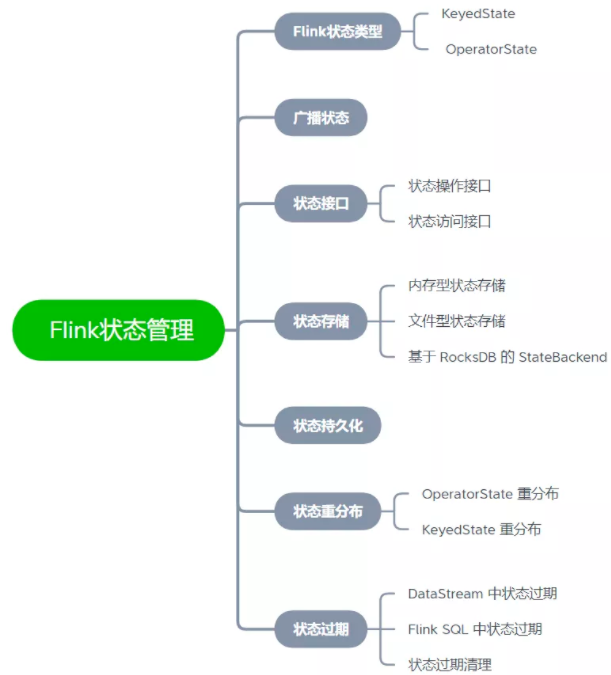

# Flink状态原理

> Flink 

## 通俗理解什么是状态？

- 状态被称作state，在Flink中，是用来 **保存** 中间的 **计算结果** 或者 **缓存数据。**

- 根据状态是否需要保存中间结果，分为 **无状态计算** 和 **有状态计算。**

  - - 对于流计算而言，事件持续产生，如果每次计算**相互独立**，不依赖上下游的事件，则相同输入，可以得到相同输出，*是无状态计算*。
    - 如果计算需要**依赖**于之前或者后续事件，则被称**为有状态计算**。

